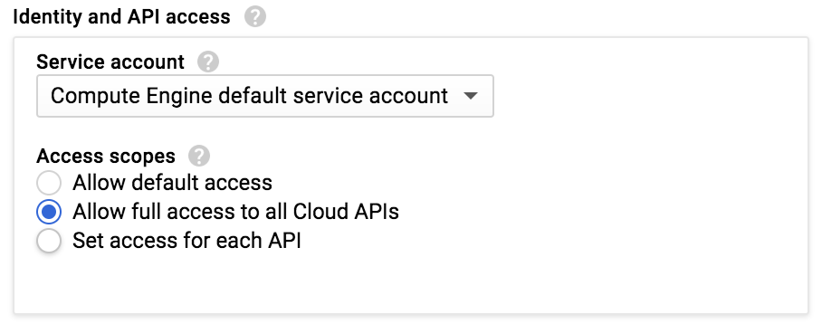

# Publishing/Subscribing Shakespeare to Pub/Sub

This is a simple set of scripts to trivially demonstrate publish/subscribe using Google Cloud Pub/Sub.

This code will read from a Google Cloud Storage bucket, do a little text processing, and 
write messages to Google Cloud Pub/Sub. As the title suggests, we'll (re?)publish a Shakespeare
play to Pub/Sub. We'll then use a pull subscription to read the messages back.

# Pre-requisites

## Get a Google Cloud Platform Project

To try this, you'll need to have set up a Google Cloud Platform project. You can take advantage of the [GCP free trial](https://console.cloud.google.com/freetrial) if you like.

You can skip these steps if you're certain Pub/Sub is already ready to use in your project.

Next, run through the Pub/Sub [Quickstart: Using the Console](https://cloud.google.com/pubsub/docs/quickstart-console) guide to make sure you can use Pub/Sub.

## Set up a compute instance

We will use this instance to work with the code. Use a Google Compute Engine instance to avoid the inevitable "doesn't work for me" scenario. Feel free to adapt this to your laptop if you like.

Create a n1-standard-1 instance using the **Ubuntu 16.04 LTS** image in the Cloud Platform UI.

Be sure to allow all API access from the instance:



Launch cloud shell. Run the following, substituting your instance's name as needed:

```
gcloud compute ssh instance-1
```
 
You will probably be promted to create an ssh key - follow the prompts. A passphrase for your ssh key is not necessary for this workshop.

Once logged in, update your gcloud components:

```
gcloud components update
```

Then install git and python-(pip|virtualenv):

```
sudo apt-get update
sudo apt-get install python-pip python-virtualenv git
```

Create and source a virtualenv, then install `google-cloud-pubsub` and `google-cloud-storage`:

```
virtualenv ~/.env
source ~/.env/bin/activate
pip install --upgrade google-cloud-pubsub google-cloud-storage
```

Now, get this code from this repository:

```
git clone https://github.com/vicenteg/shakespeare-pubsub.git
cd shakespeare-pubsub
```

Your directory should look something like this:

```sh
$ tree
.
├── LICENSE
├── README.md
├── plays
│   ├── hamlet.txt
│   └── kinglear.txt
├── publish_shakespeare.py
└── subscribe_shakespeare.py
```

# Run the publisher

Now run the publisher script. This script will read a play (King Lear) from Google Cloud Storage, make a half-hearted attempt to filter out non-speaking lines, and publish each line to Pub/Sub as a JSON object.

```sh
python publish_shakespeare.py
```

It should run for a while, then exit.

# Run the subscriber

```commandline
python subscribe_shakespeare.py
```

Nothing much should happen for several seconds before the program exits reporting that it got no messages. Why do you think? [Answer is here.](#why-no-messages)

Re-run the publisher, and re-run the subscriber. You can invoke the publisher in the background, and invoke the subscriber right after:

```
python publish_shakespeare.py & python subscribe_shakespeare.py
```

You should see some output like:

```commandline
[1] 14130
KING LEAR   [u'Woe, that too late repents,--', u'\t        O, sir, are you come?', u'Is it your will? Speak, sir.
 Prepare my horses.', u'Ingratitude, thou marble-hearted fiend,', u"More hideous when thou show'st thee in a chil
d", u'Than the sea-monster!']
KING LEAR   [u'What, fifty of my followers at a clap!', u'Within a fortnight!']
GONERIL   [u'Do you mark that, my lord?']
GONERIL   [u'Take you some company, and away to horse:', u'Inform her full of my particular fear;', u'And thereto
 add such reasons of your own', u'As may compact it more. Get you gone;', u'And hasten your return.', u'\t  No, n
o, my lord,', u'This milky gentleness and course of yours', u'Though I condemn not, yet, under pardon,', u"You ar
e much more attask'd for want of wisdom", u'Than praised for harmful mildness.']
Gentleman   [u'Ready, my lord.']
EDMUND   [u'Not a word.']
EDMUND   [u'The duke be here to-night? The better! best!', u'This weaves itself perforce into my business.', u'My
 father hath set guard to take my brother;', u'And I have one thing, of a queasy question,', u'Which I must act: 
briefness and fortune, work!', u'Brother, a word; descend: brother, I say!', u'My father watches: O sir, fly this
 place;', u'Intelligence is given where you are hid;', u'You have now the good advantage of the night:', u"Have y
ou not spoken 'gainst the Duke of Cornwall?", u"He's coming hither: now, i' the night, i' the haste,", u'And Rega
n with him: have you nothing said', u"Upon his party 'gainst the Duke of Albany?", u'Advise yourself.']
REGAN   [u'No marvel, then, though he were ill affected:', u"'Tis they have put him on the old man's death,", u'T
o have the expense and waste of his revenues.', u'I have this present evening from my sister', u"Been well inform
'd of them; and with such cautions,", u'That if they come to sojourn at my house,', u"I'll not be there."]
EDMUND   [u'I shall serve you, sir,', u'Truly, however else.']
ACT II   [u'']
Got 10 messages.
```

Now, go back to [Pub/Sub in the console](https://console.cloud.google.com/cloudpubsub) and delete your topic. Now, in the shell, run the subscriber again. What the heck? Why are there still messages after deleting the topic? [Answer here](#why-are-there-still-messages-after-deleting-the-topic).


# Spoiler Alert! ANSWERS below!

## Why no messages?

Because your subscription was created *after* the publisher wrote messages to the topic. Subscribers will only see messages that were added to the topic after a subscription is created. No subscriptions exist when the topic is first created. If we wanted to ensure that we saw all messages, we could have created a subscription before publishing any messages. If a subscriber uses the same subscription, they should see all the messages.

## Why are there still messages after deleting the topic?

Messages remain available after the topic is deleted if subscriptions to the topic still exist. Delete the subscription and no more messages will be delivered.
